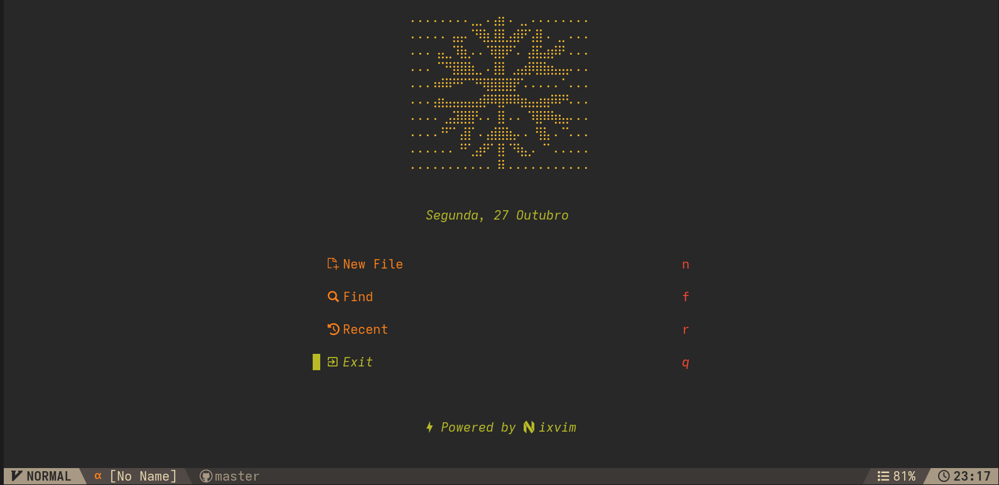
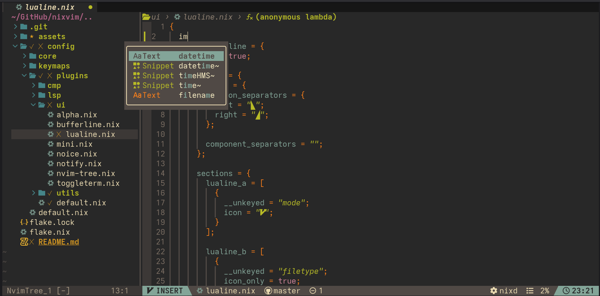
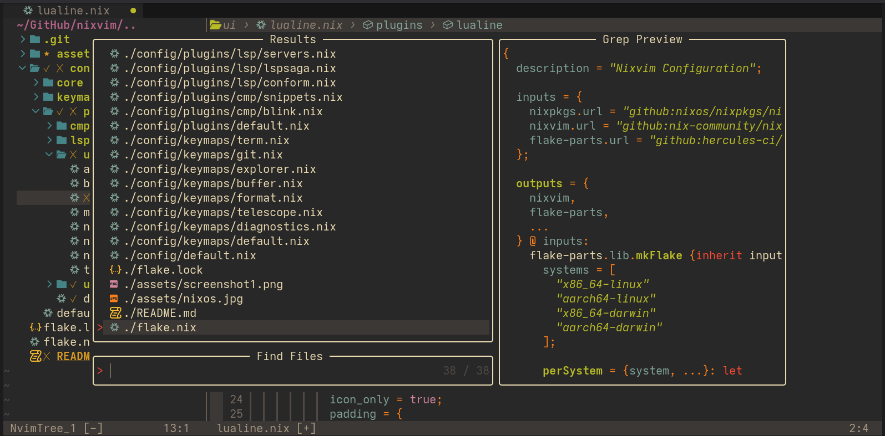

<h1 align="center">❄️ Nixvim Configuration ❄️</h1>

    
Screenshots

## What is this?

This is my personal Nixvim configuration, meticulously crafted with a focus on productivity, reproducibility, and providing an exceptional development experience. Nixvim allows you to configure Neovim using the Nix language, ensuring a consistent and easily replicable development environment across any machine.

## Installation

Getting started with this configuration is straightforward. Simply follow the installation guide below.

However, if you'd like to give it a try before installing, `nix run github:guilhermeromanholo/nixvim` is available!

